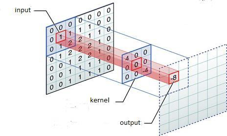
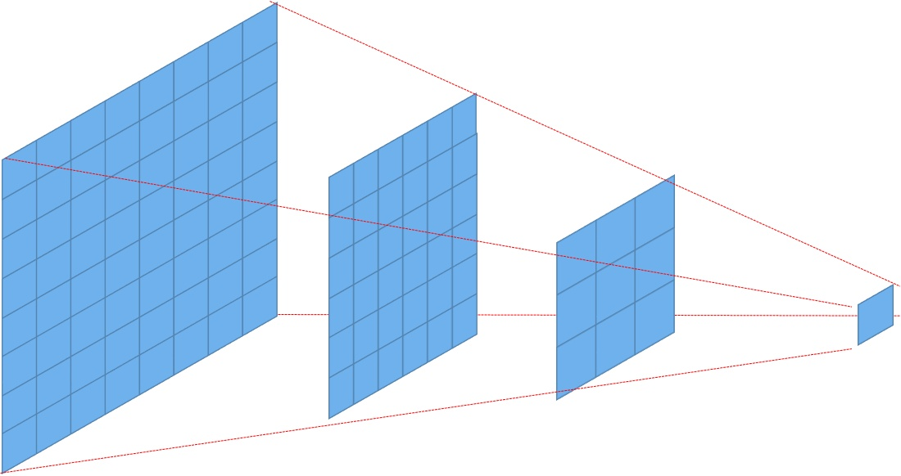

Team members:

Shilpa M - Monday batch (online)

Sushmitha M Katti - Friday batch (online)

score = [0.03926073323299575, 0.9923]

**Convolution** - It is a process of tranforming a set of pixels of an image to a single pixel by performing dot product of 
the convolution filter and image pixels.

**Filters/Kernels** - These are feature extractors which extract a particular feature such as an horizontal edge, vertical edge, curve etc from the set of images given as input.

**Epochs** - An epoch is one forward propagation + backpropagation in a neural network.

**1x1 Convolution** - It is a 1x1xN matrix where N represets no. of kernels.A 1x1 kernel visits each pixel of the input and
produces an output with the same width and height as input but the depth of N. It is mostly used for dimentionality reduction.

**3x3 Convolution** - It is 3x3 matrix which converts 3x3 pixels of an image into a single pixel.Output of of 3x3 kernel will always
be 2 pixels less than the input to the kernel. A 3x3 kernel can be used to derive kernels of bigger size and so it is a good kernel
size to use.

**Feature Maps** - A single channel can be called a feature map.
eg. A feature map can be a collection of all images of eyes given an image of a group of people.
               
**Activation Function** - It decides the output value of a neuron in the neural network.  

**Receptive Field** - It is the no. of pixels that a pixel in a particular layer has seen.The receptive field can be local or global. 

